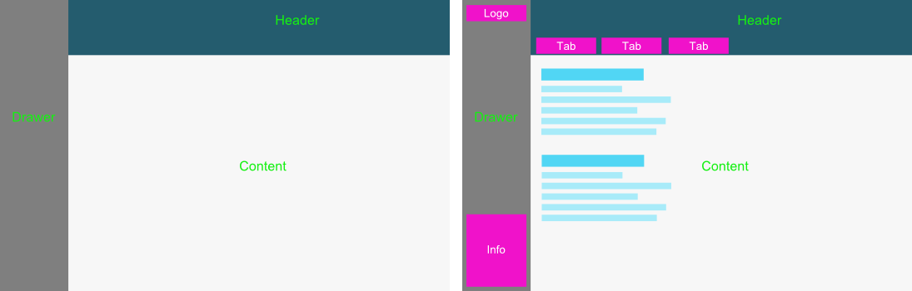

# Spin-up

-   checkout the repo
-   Spin-up the the app
    -   `cd` to the repo
    -   `run npm install`
    -   `npm start`
-   To startStart GQL API (optional)
    -   `./node_modules/.bin/graphql-faker --open`
-   In the browser
    -   http://localhost:3000
    -   http://localhost:9002/editor (to create a GQL schema)
    -   http://localhost:9002/graphql (API endpoint)

*   Have a detailed look at the folder structure and get an overview how we implemented the application in a domain-driven design. Take your time with this task as for the following work items we primarily value good structure and organization of your code.
*   The general page design and what the result should lookg like:

* We implemented a hook to run eslint before every commit to ensure the quality of the code.
You can configure your IDE to handle the linter errors or just run:

    - `npm run lint`

    to see what makes problems. Warnings are ok, but errors not.

**So, ready? Here are the tasks, finally.**

# Tasks

## #1 Render components in the drawer (★☆☆☆☆)

-   create a logo at the top of the drawer
-   create an info box at the bottom of the drawer
-   use some nice-looking MaterialUi components where applicable
-   surprise us with some creative elements related to our product
-   don't forget: we are looking at your code, consider best practice approaches everywhere

## #2 Render tabs in the header (★★★☆☆)

-   render tabs in the blue area at the top.
-   use the MaterialUI tab component
-   the data can either be provided by a hard-coded object (e.g. json) somewhere in the app (chose the fields you add to this object consciously) or...
-   alternatively it can come from a faker api (see task **#3**)

## #3 Optional: Use a faker GraphlQL api (★★☆☆☆)

-   use a fake API to fetch data for the project tabs
-   Get familiar with the package (`graphql-faker`) and adapt the schema in `schema.graphql`.
-   The schema currently contains the root type (Query) and two further types.

## #4 Create routing schema (★★☆☆☆)

-   create a new route `/projects` in the app
    -   render individual component in the content area
    -   e.g. show a text: "Please select a project from the tabs"
-   create a new variable route `/projects/:id`
    -   render individual component in the content area according to task **#5**
-   handle the onClick event of the tabs
    -   change the url (e.g. `/projects/2` for clicking the second tab)
    -   update the content of the page. There is many ways how to implement that. We are looking forward to **your** approach

## #5 Render content for project (★★★☆☆)

In the page content :

-   h1 component to show the project title
-   Some product-related information that is stored in your data object
-   be creative ;)
-   2 buttons allowing for switching the project's status
    -   statuses can be "draft", "tendering", "awarded", etc. chose your own ;)
-   for the buttons we value if you use composition
-   we keep an eye on how you organize the button markup in files, the naming of the components aswell as how "smart" or "dump" your components are
-   buttons should be controlled by props in terms of:
    -   loading
    -   disabled
    -   onClick callback
    -   dynamic text
-   buttons vary in the background color

In the drawer:

-   show the project's title
-   show the project's status in a MaterialUi chip

## #6 Update project's status (★★★☆☆)

-   On a button click the project's status should update
-   e.g. the information in the drawer buttom should update

Happy coding :)
